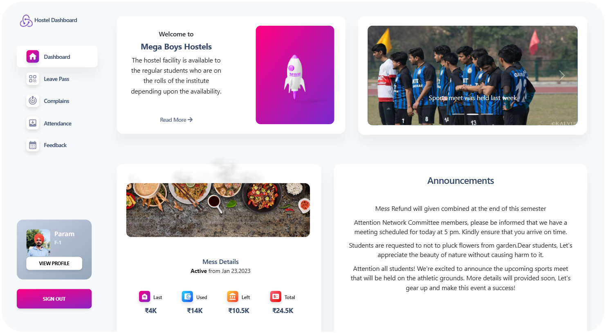
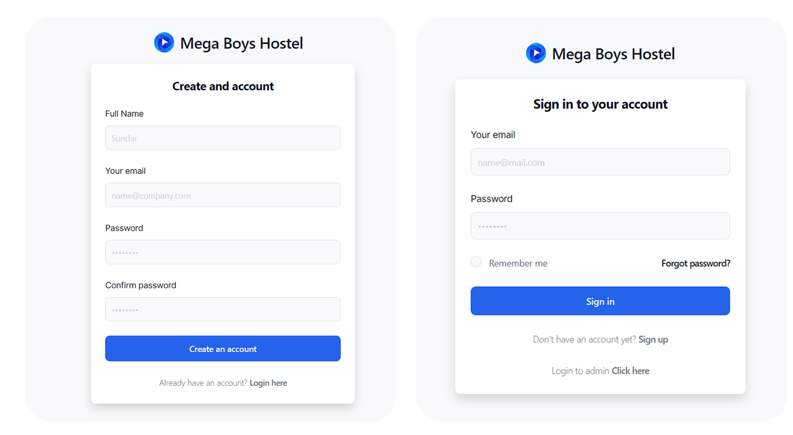
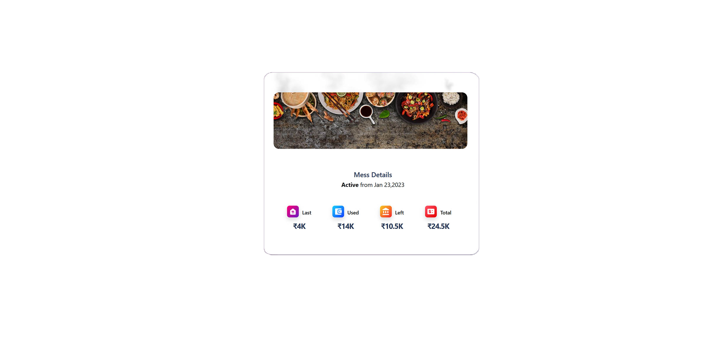
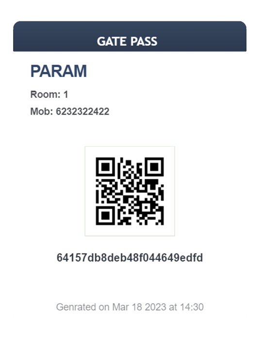
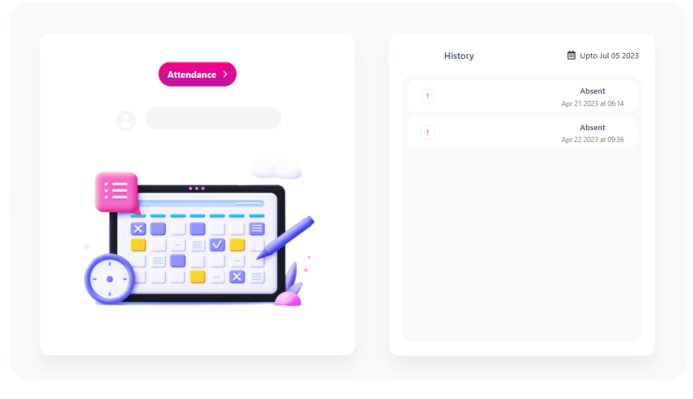
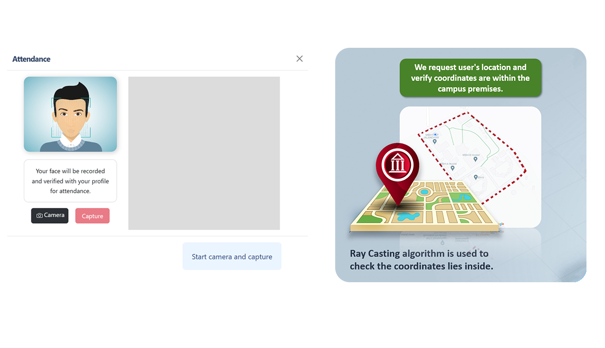
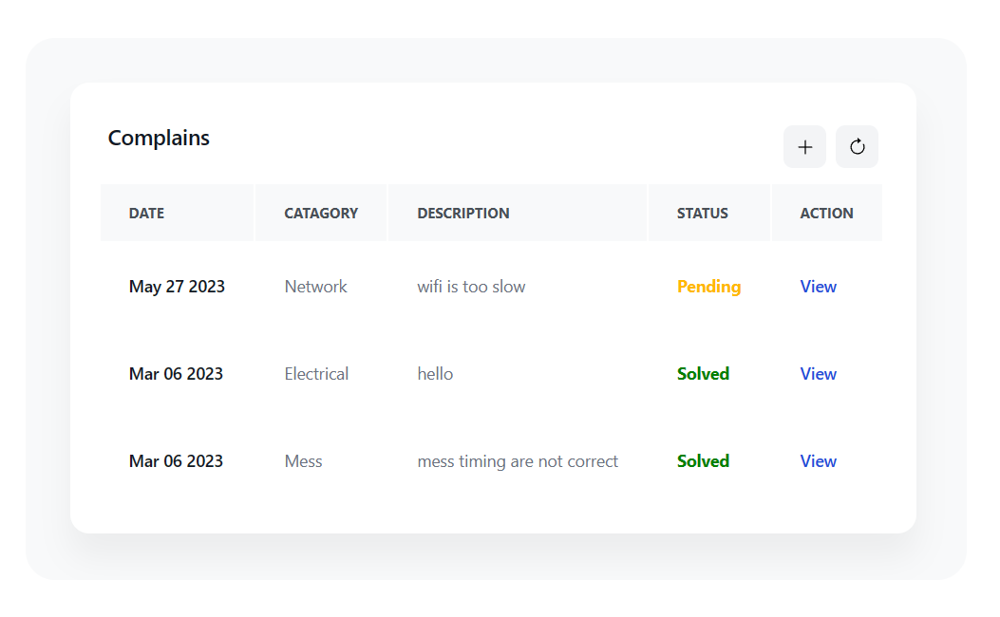
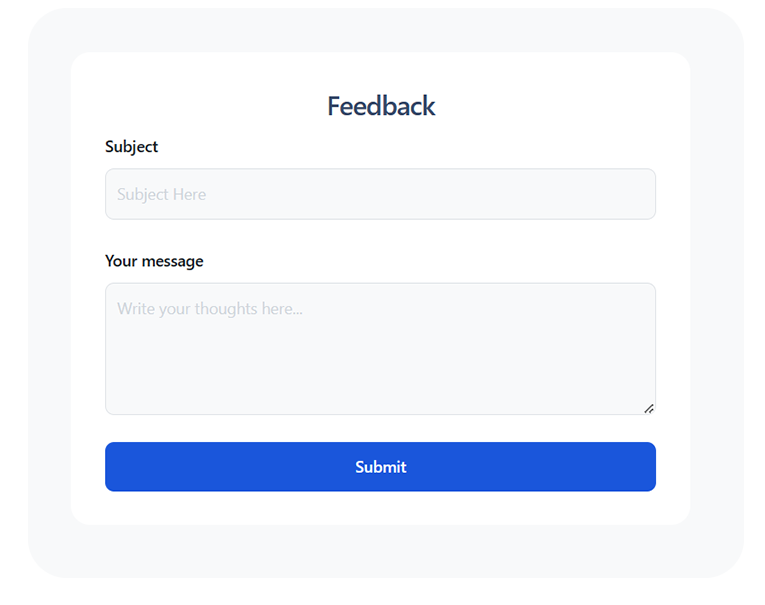
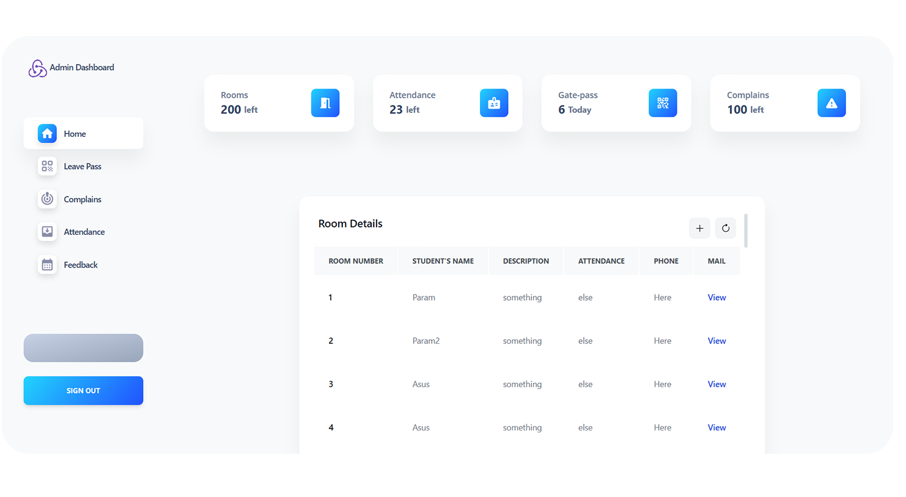

# Modern Hostel Management System

The Modern Hostel Management System is a comprehensive application designed to facilitate the management and operations of a hostel. It offers various features such as registration/sign-in, room booking, QR-based gate pass token, attendance with face and location verification, complaint section, feedback section, and an admin dashboard.

## 



#

## Key Features:

### Registration/Sign-in
- Students can register and create an account to access the system.
- Existing students can sign in using their credentials.



### Room Booking
- Students can view available rooms and book them based on their preferences and availability.


### Mess Bills
- Students can view their mess bill details, including their current balance, the bill for the current month, and previous expenses.



### QR-Based Gate Pass Token
- Students have to fill leave form and can download their gate pass .
- The gate pass token will be scanned by security personnel at the gate for verification.




### Attendance with Face and Location Verification
- Students' attendance will be marked after face and location verification.
- The system checks if the student is not on leave before verifying the location.
- Students need to scan their face for attendance verification.





### Complaint Section
- Students can submit complaints or issues they encounter within the hostel.
- They can track the status of their complaints and receive updates.



### Feedback Section
- Students can provide feedback on their experiences or suggest improvements.



### Admin Dashboard
- The admin dashboard provides access to manage and monitor various aspects of the hostel management system.
- Admins can view and manage registrations, room bookings, leave applications, attendance records, complaints, and feedback.



## Installation

1. Clone the repository:

```bash
git clone https://github.com/paramsgit/Hostel_minor_project.git
```
2. Install the necessary dependencies:
```bash
cd Hostel_minor_project
npm install
```
3. Start the server
```bash
npm start
```
Access the application via http://localhost:3000.

Now Setup Backend

1. Install the necessary dependencies:
```bash
cd Backend
npm install
```
2. Start the server
```bash
node index.js
```
Access the application via http://localhost:5000.

Now setup python server for Face recognition.

1. Install the necessary dependencies:
```bash
cd ..
cd Python
pip install -r requirements.txt
```
2. Start the microservice
```bash
python python.py
```

# Configuration
You need to set your MongoDB URL in the `db.js` file located in the Backend folder.

```
const mongouri ="YOUR_MONGO_URL"
```
e.g. -> const mongouri ="mongodb://127.0.0.1:27017/app"
#

## Technologies Used
`NodeJS`,
`ExpressJS`,
`MongoDB`,
`ReactJS`,
`Python`,
`Tailwind`,

# Contributing
Contributions are welcome! If you'd like to contribute to this project, please follow these steps:

- Fork the repository.
- Create a new branch for your feature/bug fix.
- Make your changes and commit them with descriptive commit messages.
- Push your changes to your forked repository.
- Submit a pull request detailing your changes.